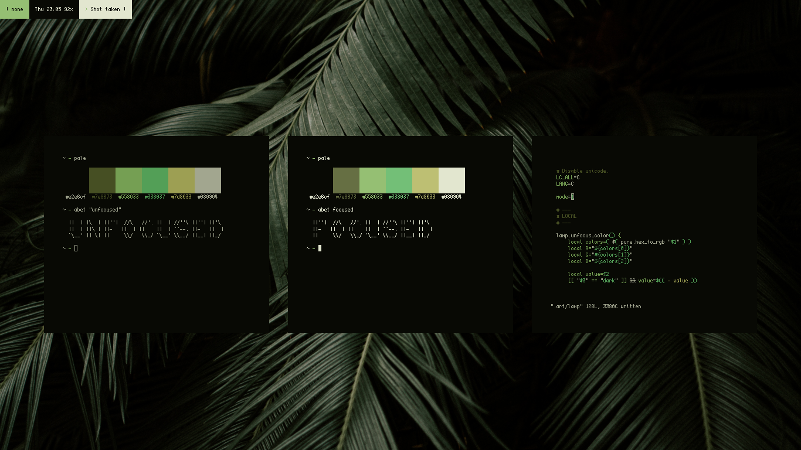
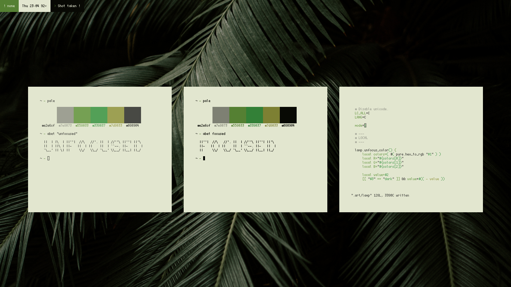
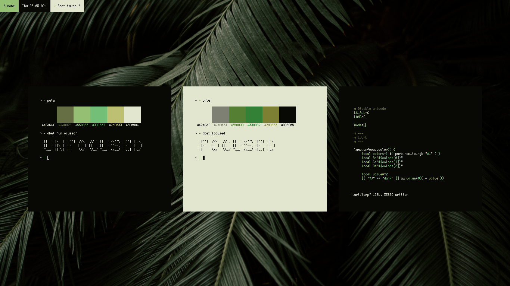
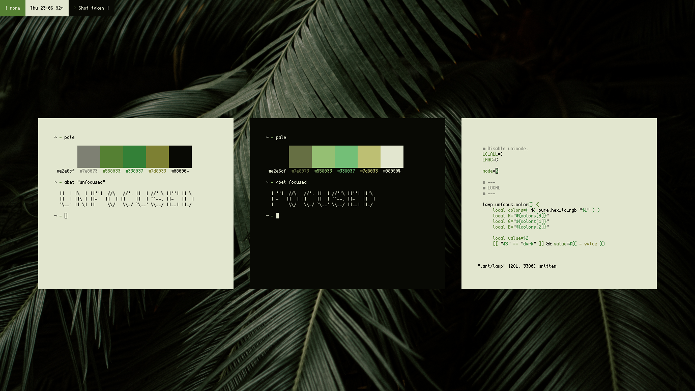

# lamp

`lamp` is a very simple deamon-less terminal effect manager. The main goal of this script is to push the potential of `art` even further by using it's api and taking the window focus to another level. There are different modes available, which are quite unique in there own way. If you have some ideas for a new mode, open an issue and let me know !

## mode 1

### Dark version

### Light version

## mode 2

### Dark version

### Light version

