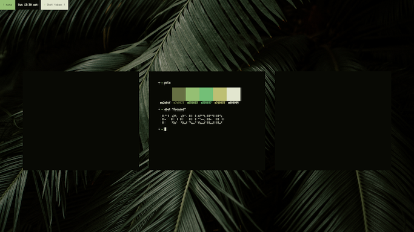

# lamp

`lamp` is a very simple deamon-less terminal effect manager. The main goal of this script is to push the potential of `art` even further by using it's api and taking the window focus to another level. There are different modes available, which are quite unique in there own way. If you have some ideas for a new mode, open an issue and let me know !

## How to install ?

### Dependencies

- `art`: used to process everything including colors
- `xdotool`: used to get the name of the focused window

### Insctructions

#### .bashrc

Add this lines to your `.bashrc` (or any other shell run commands file):

```bash
# Set title of the window (used in lamp)
PROMPT_COMMAND='echo -en "\033]0;$(tty)\007"'
DISABLE_AUTO_TITLE=true
```

#### lamp

Add `lamp` to your `PATH`:

```bash
cd WHEREVER_YOU_WANT
git clone https://github.com/gawlk/lamp.git
cd lamp
echo "PATH="${PATH}:$( pwd )" >> ${HOME}/.bashrc
```

#### Window Manager

Now the hardest part, `lamp` **is deamon-less**, which means it has to be ran each time a new window is being focused.

Some may disagree but it was a clear choice from the start, feel free to make a deamon if want to !

So the idea is to change the configuration file of your WM and make it run `lamp` everytime you:
- open a terminal
- kill a window
- focus a window
- change the workspace

Here are examples, which illustrates how it can be done for:
- [2bwm](https://github.com/gawlk/dots/blob/master/2bwm/config.h)
- [Bspwm](https://github.com/gawlk/dots/blob/master/sxhkd/sxhkdrc)

Unfortunately, if your WM supports mouse events and you can't or don't want to disable them, you might have undesired results like not having `lamp` launched when a window is being focused.

I had a situation like that with `2bwm`, which focuses every window that happens to be under the mouse pointer. Since this option can't be disable without changing the source code, I decided to change it and make instead 2bwm [launch `lamp` everytime the focus is set](https://github.com/gawlk/dots/blob/master/2bwm/2bwm.c?utf8=%E2%9C%93#L1632).

I understand that this may not be practical for everybody but there is no other way without a deamon.

## How to use ?

```
lamp - A deamon-less terminal effect manager

Example: lamp -m "4+2+1"

Arguments:
(none)                  Launch lamp
-h | -help              Display this menu and exit
-m | -modes "number"    Set a different mode or modes to load
```

## TODO

- Add more options
- Find a better way to determined which terminal is being focused

## Previews

### Hightlight (mode 1)

#### Dark version


#### Light version


### Yin Yang (mode 2)

#### Dark version


#### Light version


### Stealth (mode 3)

#### Dark version



#### Light version


### Black and white (mode 4)

#### Dark version


#### Light version


